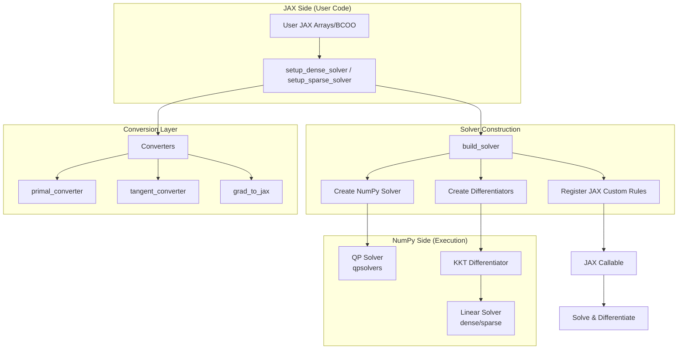
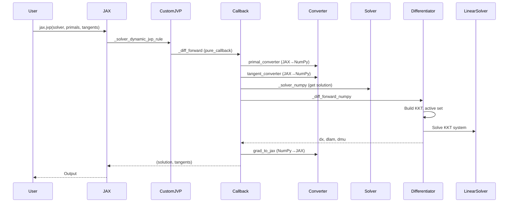
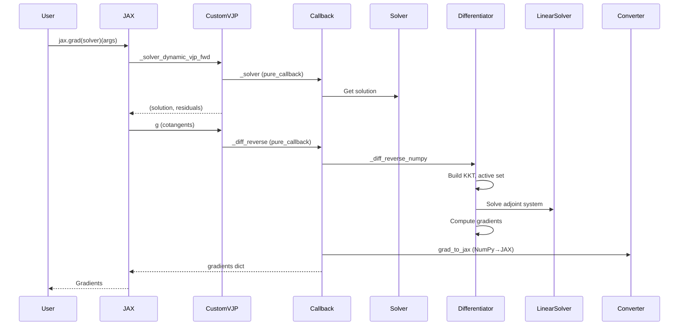

Here's a comprehensive explanation of how the JAXSparrow system works:

# JAXSparrow Architecture Overview

## System Overview

JAXSparrow is a framework that creates differentiable quadratic programming (QP) solvers in JAX. It provides both dense and sparse solvers that can be differentiated through using forward-mode (JVP) or reverse-mode (VJP) automatic differentiation.

## High-Level Data Flow



## 1. Entry Points and Setup

### Dense Path (`_solver_dense/setup.py`)
```python
setup_dense_solver(n_var, n_ineq, n_eq, fixed_elements, options)
```
**Data Flow:**
1. Validates dimensions and shapes using `make_expected_shapes()`
2. Computes required keys: always `P`, `q`, plus `A`/`b` if `n_eq > 0`, plus `G`/`h` if `n_ineq > 0`
3. Identifies dynamic keys (those not in `fixed_elements`)
4. Creates NumPy solver via `create_dense_solver()`
5. Creates differentiators via `create_dense_kkt_differentiator_fwd/rev()`
6. Delegates to `build_solver()` in `_utils/solver_common.py`

### Sparse Path (`_solver_sparse/setup.py`)
Similar flow, but with additional sparsity handling:
```python
setup_sparse_solver(n_var, n_ineq, n_eq, sparsity_patterns, fixed_elements, options)
```
**Key Differences:**
- Requires `sparsity_patterns` dict for dynamic sparse keys (P, A, G)
- Builds `sparsity_info` via `build_sparsity_info()` from BCOO patterns
- Creates specialized converters that handle BCOO ↔ CSC conversion

## 2. Data Conversion Layer

### Dense Converters (`_solver_dense/converters.py`)
```python
primal_converter(key, val, dtype) -> ndarray
tangent_converter(key, val, dtype) -> ndarray  # preserves batch dim
grad_to_jax(key, val, dtype) -> Array
```
**Purpose:** Convert between JAX arrays and NumPy arrays, handling:
- Batch dimension squeezing for primals
- Batch dimension preservation for tangents

### Sparse Converters (`_solver_sparse/converters.py`)
```python
make_sparse_primal_converter(sparsity_info) -> converter
make_sparse_tangent_converter(sparsity_info) -> converter
make_sparse_grad_to_jax_forward(sparsity_info) -> converter
make_sparse_grad_to_jax_reverse(sparsity_info) -> converter
```
**Purpose:** Handle JAX BCOO ↔ SciPy CSC conversion with sparsity patterns:

| Key Type | Primal | Tangent (unbatched) | Tangent (batched) | Gradient |
|----------|--------|---------------------|-------------------|----------|
| Sparse | CSC | CSC | Dense (batch, m, n) | nnz-length array |
| Dense | ndarray | ndarray | ndarray | ndarray |

## 3. Solver Layer

### Dense Solver (`_solver_dense/solvers.py`)
```python
create_dense_solver(n_eq, n_ineq, options, fixed_elements) -> SolverFn
```
**Flow:**
1. Creates backend via `get_backend()` (default: `QpSolversBackend`)
2. Calls `backend.setup()` with fixed elements
3. Returns closure that:
   - Merges fixed + runtime ingredients
   - Calls `backend.solve()` 
   - Extracts solution (x, lam, mu)

### Sparse Solver (`_solver_sparse/solvers.py`)
Similar to dense, but:
- Expects CSC matrices for sparse keys
- Uses same `QpSolversBackend` (handles sparse matrices naturally)

### Solver Backend (`_utils/solver_backends.py`)
```python
class QpSolversBackend(SolverBackend):
    def setup(self, fixed_elements):
        # Cast and store fixed elements
        
    def solve(self, **kwargs):
        # Merge fixed + runtime, build Problem, solve with qpsolvers
```

## 4. KKT Differentiator

### Dense KKT (`_solver_dense/dense_diff_backend.py`)
```python
class DenseKKTDifferentiatorBackend(DifferentiatorBackend):
    def setup(self, fixed_elements, dynamic_keys):
        # Store fixed elements, pre-compute zero tangents
        
    def differentiate_fwd(self, sol_np, dyn_primals_np, dyn_tangents_np, batch_size):
        # Build dense KKT system: [[P, H^T], [H, 0]]
        # Solve with dense linear solver
        # Return dx, dlam, dmu
        
    def differentiate_rev(self, dyn_primals_np, x_np, lam_np, mu_np, g_x, g_lam, g_mu, batch_size):
        # Build same KKT system
        # Solve adjoint system
        # Compute gradients for all dynamic parameters
```

**KKT System Assembly:**
```python
# Active set detection
active_np = np.abs(G @ x - h) <= cst_tol

# Build constraint matrix H (equalities + active inequalities)
H = vstack([A, G[active_np]])

# KKT matrix
lhs = [[P, H.T],
       [H, 0]]
```

### Sparse KKT (`_solver_sparse/sparse_diff_backend.py`)
Similar to dense, but:
- Uses sparse CSC matrices
- Builds sparse KKT via `sp_bmat`
- Uses sparse linear solvers (splu, spilu, spsolve)
- Gradient computation uses sparsity patterns to only compute non-zero entries

## 5. Linear Solvers (`_utils/linear_solvers.py`)

Two registries with automatic conversion:
```python
# Dense native: "solve", "lstsq", "lu"
# Sparse native: "splu", "spilu", "spsolve", "sp_lstsq"

def get_dense_linear_solver(name):
    # Tries dense native, then wraps sparse solver (dense → CSC)
    
def get_sparse_linear_solver(name):
    # Tries sparse native, then wraps dense solver (CSC → dense)
```

## 6. JAX Integration (`_utils/solver_common.py`)

### Core Building Function
```python
def build_solver(*, n_var, n_ineq, n_eq, options_parsed, fixed_keys_set,
                 solver_numpy, diff_forward_numpy, diff_reverse_numpy,
                 primal_converter, tangent_converter, grad_to_jax,
                 vjp_bwd_shapes, fd_check):
```

**What it does:**
1. Creates internal `_solver` callback that:
   - Converts JAX → NumPy using converters
   - Calls NumPy solver
   - Returns JAX arrays

2. Creates `_diff_forward` callback that:
   - Computes primals and tangents
   - Detects batching from tangent shapes
   - Calls forward differentiator

3. Creates `_diff_reverse` callback that:
   - Processes cotangents
   - Calls reverse differentiator
   - Converts gradients back to JAX

4. Registers JAX custom rules:
   - Forward mode: `custom_jvp` with `_solver_dynamic_jvp_mode` and `_solver_dynamic_jvp_rule`
   - Reverse mode: `custom_vjp` with `_solver_dynamic_vjp_fwd` and `_solver_dynamic_vjp_bwd`

5. Returns public `solver` closure with attached `timings` and `fd_check`

### Batching Detection
```python
# Tangent shapes indicate batching
if v.ndim > EXPECTED_NDIM[k]:
    batch_sizes.append(v.shape[0])
batch_size = max(batch_sizes) if batched else 0
```

## 7. Timing and Debugging

### Timing Recorder (`_utils/timing_utils.py`)
```python
class TimingRecorder:
    def record(self, func_name, t):
        # Stores timing dicts per function
        
    def summary(self):
        # Returns formatted table with per-key statistics
```

### FD Checker (`_utils/fd_recorder.py`)
```python
class FiniteDifferenceRecorder:
    def check_jvp(self, solve_fn, dyn_primals_np, dyn_tangents_np, ...):
        # Central FD: (f(p+εd) - f(p-εd)) / (2ε)
        
    def check_vjp(self, solve_fn, dyn_primals_np, grads_analytic, ...):
        # Check g^T·(df/dp)·d via FD
        
    def summary(self):
        # Returns error statistics table
```

## 8. Complete Execution Flow

### Forward Mode (JVP)


### Reverse Mode (VJP)


## Key Design Patterns

1. **Two-Phase Lifecycle**: Setup (once) + Call (repeated) for both solvers and differentiators
2. **Backend Registry**: Pluggable backends via `register_differentiator_backend()` and `register_backend()`
3. **Converter Abstraction**: Dense and sparse paths define their own conversion logic
4. **Pure Callback Boundary**: All NumPy execution happens inside `pure_callback`, separate from JAX tracing
5. **Active Set Management**: Inequalities handled via active set detection with tolerance
6. **Unified KKT Formulation**: Both dense and sparse use same mathematical formulation